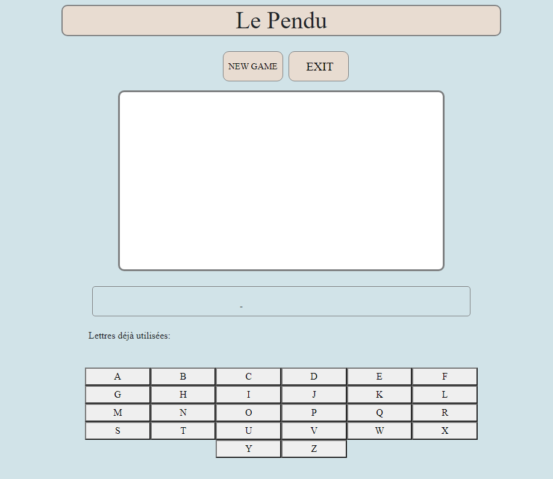

# The-Hangman-Game

## Description 
  Creation of a hangman game during my training at BeCode. A hidden word is give randomly. The user must find out in max 8 chances.

## Preview of my page

 ## Features
 * Suggestion of a new word chosen at random
  * virtual keyboard allowing the choice of letters by the user
  * Analyze if the chosen letter is part of the word or not
   if so, then the letter is put back in the right place
  * if not, then the letter is placed in a list of letters already in use
  * if the letter is not correct then a gallows appears and then a head until the bohnomme is completely hanged.
  * When we click on the NEW GAME button we generate a new word.
  * When you click on the EXIT button, you exit the page.

## Being finalized
   * If the chosen letter appears twice in the word, it must be placed in both places.
   * If the user finds the word before being hanged there should be an alert message congratulating them

## How I proceeded
I first created a mock-up of my page on paper. I then listed the steps to take to arrive at the different actions. I worked out my HTMK and SCSS code and finished with the JS.
